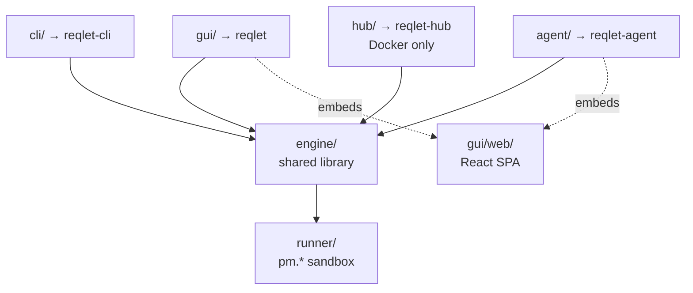
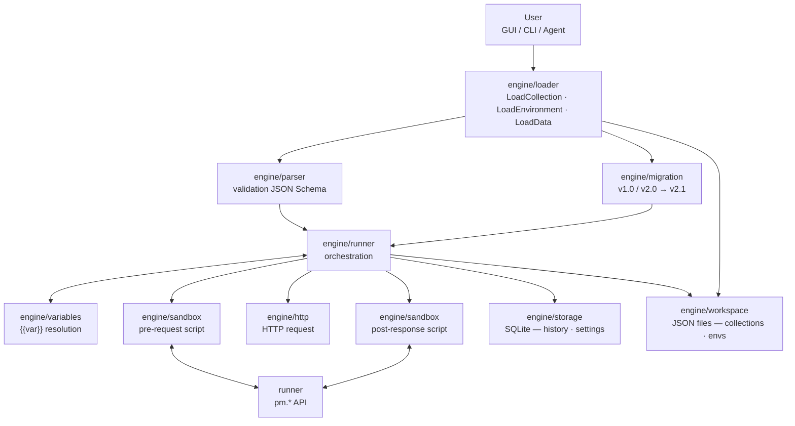
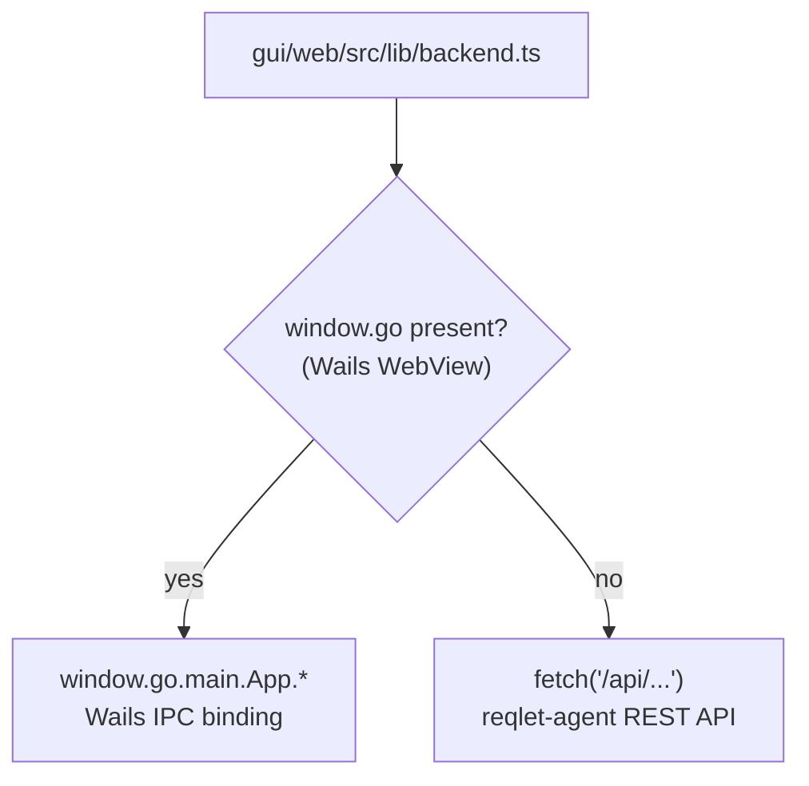

# Architecture

## Overview

Reqlet is a monorepo with a single `go.mod`. The codebase is split into six
distinct layers that share no circular dependencies:

```
engine/  ← shared Go library (business logic)
cli/     ← CLI binary (cobra) → binary: reqlet-cli
gui/     ← Wails v2 desktop app → binary: reqlet
agent/   ← web agent (Go HTTP server) → binary: reqlet-agent
hub/     ← collaboration server (Go + chi) → binary: reqlet-hub (Docker only)
runner/  ← Node.js process (pm.* sandbox), communicates via stdio JSON
```



## Component breakdown

### `engine/`

The core library. All business logic lives here and is reused by the CLI,
the GUI backend, and the web agent. Sub-packages follow a single
responsibility principle:

| Package | Responsibility |
|---------|---------------|
| `engine/parser` | Read and validate Postman collection files; detect format version (v1.0/v2.0/v2.1); enforce official JSON Schema for v2.0 and v2.1 (schemas embedded via `go:embed`) |
| `engine/migration` | Transform parsed v1.0 and v2.0 collections into the v2.1 internal model |
| `engine/loader` | Single entry point for callers (CLI, GUI, agent): `LoadCollection` (parse + migrate → v2.1), `LoadEnvironment`, `LoadData` (CSV/JSON → `[]map[string]string`) |
| `engine/runner` | Orchestrate request execution (ordering, iterations, data injection) |
| `engine/reporter` | Output formatters: terminal (ANSI colours), JSON, JUnit/XML |
| `engine/http` | Execute HTTP requests (`net/http`, redirects, TLS, proxy, client certificates) |
| `engine/variables` | Resolve `{{variable}}` across the five Postman scopes |
| `engine/auth` | Auth strategies (Bearer, Basic, Digest, OAuth 2.0, AWS SigV4…) |
| `engine/workspace` | Read/write **content data** (collections, environments) as JSON files under `~/.reqlet/workspace/` |
| `engine/storage` | SQLite persistence for **system data** only (history, settings) via `modernc.org/sqlite` + `sqlc` + `golang-migrate` |
| `engine/sandbox` | Lifecycle management of the `runner` process (os/exec, IPC) |

### `cli/`

Single binary (`reqlet-cli`). Built with [cobra][cobra]. Has no business logic of its own;
delegates everything to `engine/`. Distributed as:

- Platform binaries (GitHub Releases): Linux x64/arm64, macOS Intel/ARM, Windows x64
- Docker image: `ghcr.io/guillaumedelre/reqlet`

### `gui/`

[Wails v2][wails] desktop application (`reqlet` binary). The Go backend exposes methods to the
React frontend via Wails bindings (`window.go.*`). The frontend communicates
back via those bindings and via `runtime.EventsEmit` / `runtime.EventsOn`.

The WebView is provided by the OS (WKWebView on macOS, WebView2 on Windows,
WebKit2GTK on Linux) — no Chromium bundled.

`gui/web/` contains the React TypeScript frontend (Vite, Tailwind v4, shadcn/ui,
Zustand). It is **not a standalone deployable** — it is a build artefact consumed
by two targets:

- `gui/` embeds `gui/web/dist/` directly via `//go:embed all:web/dist` (Wails)
- `agent/` receives a copy of `gui/web/dist/` during its Docker build, then
  embeds it via `//go:embed all:web`

Both targets run the same React codebase; `gui/web/src/lib/backend.ts` detects
at runtime whether it is running inside the Wails WebView or served by
`reqlet-agent`.

### `agent/`

Standalone Go HTTP server (`reqlet-agent` binary). It:

- Embeds `agent/web/` via `go:embed all:web` and serves the React SPA at `/`
  (`agent/web/` is populated from `gui/web/dist/` during the Docker build)
- Exposes a REST API (`/api/...`) equivalent to the Wails bindings in `gui/` (Phase 2.14 — in progress)
- Will delegate request execution to `engine/http` and script execution to `engine/sandbox`
- Stores data in a SQLite file at `/data/reqlet.db` (Docker) or `~/.reqlet/reqlet.db` (standalone)
- Listens on `:8080` internally; exposed on host port `3001` via Docker Compose (`"3001:8080"`)

**Implemented endpoints:**

| Method | Path | Description |
|--------|------|-------------|
| `GET` | `/api/health` | Liveness probe — returns `{"status":"ok"}` (HTTP 200) |
| `GET` | `/` | Serves the embedded React SPA (`index.html`) |
| `ANY` | `/api/*` | 404 — placeholder for Phase 2.14 REST routes |

The frontend auto-detects its runtime context via `gui/web/src/lib/backend.ts`: when
running inside the Wails WebView it calls `window.go.*`, when served by
`reqlet-agent` it calls `fetch("/api/...")`. The React codebase is shared
between both.

`reqlet-agent` is distributed as:

- Platform binaries (GitHub Releases): Linux x64/arm64, macOS Intel/ARM, Windows x64
- Docker image: `ghcr.io/guillaumedelre/reqlet-agent`

### `runner/`

A Node.js process that implements the [Postman sandbox][pm-sandbox] (`pm.*`
API). Go starts it as a child process (`os/exec`) and communicates via
newline-delimited JSON over stdio. Packaged as a [Node SEA][node-sea] and
embedded into `engine/sandbox` via `go:embed` — which means the SEA is bundled
into all three Go binaries (`reqlet-cli`, `reqlet`, `reqlet-agent`). No
Node.js installation is required on the end user's machine.

## Data flow (request execution)



## Frontend transport abstraction

_(Phase 2.14 — not yet implemented)_

`gui/web/src/lib/backend.ts` will provide a unified call interface for all React
components. It will detect the runtime context at call time:



This will keep the React codebase identical regardless of whether it runs inside
the Wails desktop app or is served by `reqlet-agent`.

## Storage

Local data is split into two categories with distinct storage strategies:

| Category | Examples | Storage |
|----------|----------|---------|
| **Content** | Collections, environments, variables | JSON files on disk — git-friendly, portable |
| **System** | History, preferences, settings | SQLite — relational, transactional |

### Content — filesystem (`engine/workspace/`)

`engine/workspace` takes a `basePath` parameter and never resolves the path
itself. Callers supply the final path from `REQLET_WORKSPACE_PATH` or the
OS-appropriate default:

| Context | Path |
|---------|------|
| Desktop GUI / CLI | `~/.reqlet/workspace/` |
| reqlet-agent (standalone) | `~/.reqlet/workspace/` |
| reqlet-agent (Docker) | `/data/workspace/` (override via `REQLET_WORKSPACE_PATH`) |

```
<workspace>/
├── collections/   ← one JSON file per collection (Postman v2.1 format)
└── environments/  ← one JSON file per environment
```

`git init <workspace>` works out of the box in any context — no extra
configuration needed. This layout is the foundation for Phase 4 git-based team
sync (push/pull to GitHub, GitLab, Gitea, or a self-hosted
[reqlet-hub](#reqlet-hub)).

### System — SQLite (`engine/storage/`)

| Context | Path |
|---------|------|
| Desktop GUI / CLI | `~/.reqlet/reqlet.db` |
| reqlet-agent (standalone) | `~/.reqlet/reqlet.db` |
| reqlet-agent (Docker) | `/data/reqlet.db` (named volume `reqlet-data:/data`) |

In Docker, both the SQLite file and the workspace live under the same `/data`
volume (`/data/reqlet.db` + `/data/workspace/`), so a single named volume
covers all persistent data.

Schema migrations are versioned with [golang-migrate][golang-migrate] and run
automatically at startup. Queries are type-safe Go code generated by
[sqlc][sqlc] from `.sql` files. Tables: `history`, `settings`.

`modernc.org/sqlite` is used instead of `mattn/go-sqlite3` to avoid CGo and
simplify cross-compilation.

### Phase 4 — reqlet-hub

`reqlet-hub` is a future collaboration server (Phase 4+). It adds:

- Git bare repos per team workspace (collections sync via `git push/pull`)
- PostgreSQL for users, teams, organisations, roles, and tokens
- Self-hostable: Docker Compose (no standalone binary)

## Build matrix

| Artefact | How |
|----------|-----|
| CLI — Linux x64/arm64 | GitHub Actions `ubuntu-latest` |
| CLI — macOS Intel/ARM | GitHub Actions `macos-latest` |
| CLI — Windows x64 | GitHub Actions `windows-latest` |
| Agent — Linux x64/arm64 | `Dockerfile.agent` (multi-arch) |
| Agent — macOS Intel/ARM | GitHub Actions `macos-latest` |
| Agent — Windows x64 | GitHub Actions `windows-latest` |
| GUI — Linux | `Dockerfile.gui` (WebKit2GTK in container) |
| GUI — macOS | GitHub Actions `macos-latest` (Wails) |
| GUI — Windows | GitHub Actions `windows-latest` (Wails) |
| Hub — Linux x64/arm64 | `Dockerfile.hub` (multi-arch, Docker only) |

[cobra]: https://github.com/spf13/cobra
[wails]: https://wails.io
[pm-sandbox]: https://learning.postman.com/docs/writing-scripts/script-references/postman-sandbox-api-reference/
[node-sea]: https://nodejs.org/api/single-executable-applications.html
[golang-migrate]: https://github.com/golang-migrate/migrate
[sqlc]: https://sqlc.dev
