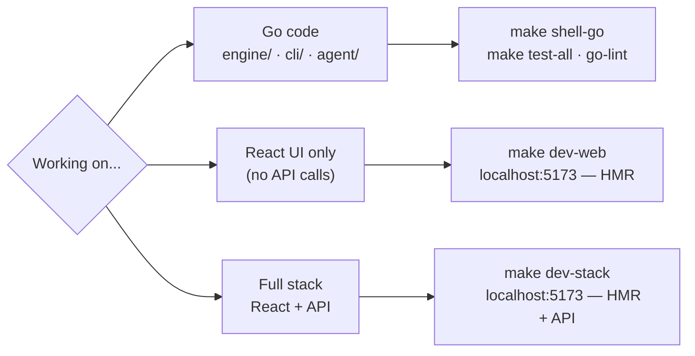

# Development guide

## Prerequisites

- [Docker][docker] (with Compose v2 plugin)
- `make`
- An editor — the project ships an `.editorconfig`

Nothing else needs to be installed on the host. All tooling runs inside
containers.

## First-time setup

```bash
# Install Go module dependencies (writes go.sum)
docker compose run --rm go go mod download

# Install Node.js dependencies for runner/
docker compose run --rm node npm install

# Install Node.js dependencies for gui/web/
docker compose run --rm web npm install
```

## Daily commands

The **Makefile** is the primary entry point. It wraps `docker compose run --rm`
for every operation:



### Choisir son workflow frontend

`gui/web/` est du code source React — pas un déployable. Il est embarqué à build time dans `reqlet-gui` et `reqlet-agent`. Trois workflows sont disponibles :

| Commande | URL | Quand l'utiliser |
|---|---|---|
| `make dev-web` | `localhost:5173` | Composants, styles, UI pure — HMR, aucun appel API |
| `make dev-agent` | `localhost:3001` | Environnement identique à la prod, pas de HMR |
| `make dev-stack` | `localhost:5173` | HMR + vrais appels API via proxy |

**`make dev-stack`** lance Vite et `reqlet-agent` en parallèle. Le proxy configuré dans
`vite.config.ts` forward automatiquement `/api/*` de Vite (5173) vers l'agent (3001).
C'est le workflow recommandé dès que Phase 2.14 sera disponible.

> En mode `dev-stack`, ouvrir `localhost:5173` (Vite, HMR). Ne pas ouvrir `localhost:3001` :
> l'agent y sert le placeholder HTML embarqué au dernier `make build-web`, pas le frontend en cours de développement.

> `make dev-agent` reconstruit l'image Docker si les sources ont changé. Pas de HMR :
> chaque modification frontend nécessite `make build-web` puis de relancer le service.

```bash
make help            # list all targets
make build-cli       # build dist/reqlet-cli
make build-web       # build gui/web/dist/
make build-agent     # build Docker image reqlet-agent
make dev-web         # start Vite dev server at http://localhost:5173 (HMR, no API)
make dev-agent       # start web agent at http://localhost:3001 (prod-like, no HMR)
make dev-stack       # start Vite + agent in parallel (HMR + API via proxy)
make test-all        # full test suite (engine/ + cli/ + agent/)
make test-unit       # unit tests only
make test-integration
make test-coverage   # generates coverage.html
make go-lint         # golangci-lint
make go-fmt          # apply gofumpt
make go-check        # check formatting without modifying
make shell-go        # interactive Go shell
make shell-node      # interactive Node.js shell (runner/)
make shell-web       # interactive shell in web container (gui/web/)
```

### Go test scope

Tests cover `./engine/...`, `./cli/...`, and `./agent/...`. `gui/` requires GTK headers
and is compiled separately via `Dockerfile.gui`.

### Go (engine/, cli/, agent/) — direct docker compose commands

```bash
# Interactive Go shell
docker compose run --rm go sh

# Run all tests
docker compose run --rm test

# Run tests with coverage report
docker compose run --rm test gotestsum -- -coverprofile=coverage.out -covermode=atomic ./engine/... ./cli/... ./agent/...

# Run unit tests only (exclude integration)
docker compose run --rm test gotestsum -- -tags=!integration ./engine/... ./cli/... ./agent/...

# Run integration tests only
docker compose run --rm test gotestsum -- -tags=integration ./engine/... ./cli/... ./agent/...

# Lint (golangci-lint via official image)
docker compose run --rm lint

# Check formatting (no changes applied)
docker compose run --rm go gofumpt -l .

# Apply formatting
docker compose run --rm go gofumpt -w .

# Build CLI binary to dist/
docker compose run --rm build-cli

# Generate mocks from an interface
docker compose run --rm go mockgen \
  -source=engine/runner/runner.go \
  -destination=engine/runner/mock_runner_test.go \
  -package=runner
```

### Node.js (runner/)

```bash
# Interactive Node.js shell
docker compose run --rm node sh

# Lint
docker compose run --rm node npm run lint

# Tests
docker compose run --rm node npm test
```

### Web UI (gui/web/)

```bash
# Start Vite dev server (accessible at http://localhost:5173)
docker compose up web

# Format (apply)
docker compose run --rm web npm run format

# Format (check only, no changes)
docker compose run --rm web npm run format:check

# Lint
docker compose run --rm web npm run lint

# Type-check and build
docker compose run --rm web npm run build

# Run tests
docker compose run --rm web npm test

# Run tests in watch mode
docker compose run --rm web npm run test:watch

# Run tests with coverage report (html + lcov in coverage/)
docker compose run --rm web npm run test:coverage

# Add a shadcn/ui component
docker compose run --rm web npx shadcn@latest add <name>
```

#### Code style

Formatting is handled by **Prettier** (`.prettierrc`) — no semicolons, double quotes, 2-space indent, 100-char line width. The ESLint config extends `eslint-config-prettier` to disable any conflicting rules.

#### Tests

Tests use **Vitest** with `jsdom` environment and **React Testing Library**. Files are colocated: `src/store/ui.test.ts` next to `src/store/ui.ts`. Coverage threshold is 80% (lines, functions, branches) — enforced locally and in CI.

| Script | What it does |
|---|---|
| `npm test` | Single run, no coverage |
| `npm run test:watch` | Interactive watch mode |
| `npm run test:coverage` | With HTML + lcov report |
| `npm run test:ci` | Verbose + JUnit XML + coverage (used in CI) |

## GUI development

`wails dev` (hot-reload) requires a display server — it cannot run in a
container.

The recommended workflow:

1. Run `docker compose up web` for the React side (Vite on port 5173).
   The Wails bindings (`window.go.*`) are mocked in the frontend so it works
   without the Go backend.
2. Develop Go backend code in the `go` container as usual.
3. Run `docker compose run --rm go wails generate types` to regenerate
   TypeScript types from Go structs whenever a bound method changes.

Linux GUI binaries are built via `Dockerfile.gui` (builds the frontend via
`npm ci && npm run build`, then `go build ./gui/...`). macOS and Windows builds
run on native GitHub Actions runners.

### UI conventions

#### HTTP method colors

HTTP methods are color-coded throughout the UI (tab badges, method selector) using the
[Swagger UI][swagger-ui] palette, defined in `gui/web/src/lib/http-methods.ts`:

| Method  | Color     | Hex       |
|---------|-----------|-----------|
| GET     | Blue      | `#61affe` |
| POST    | Green     | `#49cc90` |
| PUT     | Orange    | `#fca130` |
| PATCH   | Teal      | `#50e3c2` |
| DELETE  | Red       | `#f93e3e` |
| HEAD    | Purple    | `#9012fe` |
| OPTIONS | Dark blue | `#0d5aa7` |

Colors are used as text and as a 10 % opacity background tint (`color + "1a"`).
Any new UI surface that displays an HTTP method must import `HTTP_METHOD_COLORS`
from `@/lib/http-methods` rather than defining its own palette.

#### Monaco Editor (`src/components/ui/code-editor.tsx`)

All code editing surfaces use the shared `CodeEditor` wrapper around `@monaco-editor/react`.
It reads the current theme via `useTheme()` and selects `vs-dark` or `vs` accordingly.

```tsx
<CodeEditor
  value={code}
  onChange={(v) => updateTab(id, { bodyRaw: v })}
  language="json"   // json | xml | javascript | go | plaintext
  readOnly={false}
  height="100%"     // default — fills the flex container
/>
```

To fill available vertical space, wrap `<CodeEditor>` in a flex child with `overflow: hidden`:

```tsx
<div style={{ flex: 1, overflow: "hidden" }}>
  <CodeEditor value={...} height="100%" />
</div>
```

In tests, mock the module at the top of the file — Monaco uses Web Workers unavailable in jsdom:

```ts
vi.mock("@monaco-editor/react", () => ({
  default: ({ value, onChange }: { value: string; onChange?: (v: string) => void }) => (
    <textarea data-testid="monaco-editor" value={value ?? ""} onChange={(e) => onChange?.(e.target.value)} />
  ),
}))
```

#### Body editor

The Body sub-tab renders a type selector bar (none / form-data / urlencoded / raw / binary / GraphQL)
followed by a type-specific editor:

| Type | Editor |
|---|---|
| `none` | Informational message |
| `raw` | `CodeEditor` (Monaco) + content-type picker (JSON / XML / Text / HTML / JavaScript) — language follows the selected content type |
| `form-data` / `urlencoded` | `KeyValueEditor` |
| `binary` / `GraphQL` | "coming soon" placeholder |

Body state is stored per-tab: `bodyType`, `bodyRaw`, `bodyRawContentType`, `bodyFormData`,
`bodyUrlencoded`. The Body tab label shows a filled dot (`●`) when a non-empty body is set.

#### Pre-request Script and Tests tabs

Each request exposes two JavaScript editor tabs (matching the Postman model):

- **Pre-request Script** — runs before the request is sent. Language: JavaScript.
- **Tests** — runs after the response is received. Language: JavaScript.

Both use `CodeEditor` in JavaScript mode. Their content is stored in `preRequestScript` and
`testScript` on the tab (Zustand store, persisted). Execution requires the runner
(section 2.14 — GUI-Go bindings, not yet wired).

#### Settings tab

Per-request settings are grouped into five sections in the Settings sub-tab.

**HTTP**

| Field | Type | Default | Notes |
|---|---|---|---|
| `httpVersion` | `"auto" \| "http1" \| "http2"` | `"http1"` | Rendered as a button group (Auto / HTTP/1.x / HTTP/2) |
| `encodeUrl` | `boolean` | `true` | Percent-encode special characters in the URL before sending |
| `disableCookieJar` | `boolean` | `false` | Opt out of the shared cookie jar for this request |

**Redirects**

| Field | Type | Default | Notes |
|---|---|---|---|
| `followRedirects` | `boolean` | `true` | Follow `3xx` responses automatically |
| `followOriginalMethod` | `boolean` | `false` | Re-send with the original method instead of downgrading to `GET` |
| `followAuthorizationHeader` | `boolean` | `false` | Forward the `Authorization` header to the redirect target |
| `removeRefererOnRedirect` | `boolean` | `false` | Strip the `Referer` header on redirect |
| `maxRedirects` | `number` | `0` | Maximum hops (`0` = unlimited, matching `timeout` semantics) |

**Security**

| Field | Type | Default | Notes |
|---|---|---|---|
| `sslVerification` | `boolean` | `true` | Validate the server TLS certificate |

TLS cipher/protocol controls map to `engine/http` `tls.Config` and are not yet exposed in the frontend (section 2.11 in the roadmap).

**Timeout**

| Field | Type | Default | Notes |
|---|---|---|---|
| `timeout` | `number` | `0` | Request timeout in milliseconds (`0` = no timeout) |

**Proxy**

| Field | Type | Default | Notes |
|---|---|---|---|
| `ignoreProxy` | `boolean` | `false` | Bypass the global proxy for this request (maps to Postman `proxy-config.disabled`) |

Global proxy configuration (host, port, credentials) is stored in SQLite and applies to all requests unless `ignoreProxy` is set. The CLI exposes it via a `--proxy` flag. Implementation is tracked in section 2.12 of the roadmap.

#### Response pane

Shows an empty state ("Hit Send") until `tab.response` is non-null. When a `ResponseData` is
present it renders a status bar (status badge, time, size, **Save** button) and five sub-tabs:

| Sub-tab | Content |
|---|---|
| Pretty | Monaco editor, read-only; JSON is auto-formatted via `JSON.stringify` |
| Raw | `<pre>` with the raw body string |
| Headers | Key/value grid of response headers |
| Preview | Sandboxed `<iframe sandbox="" srcDoc={body}>` — renders HTML with scripts and same-origin access blocked |
| Visualize | Placeholder; populated by `pm.visualizer.set(template, data)` once the script engine is wired up (section 2.14) |

**Save button** triggers a `URL.createObjectURL` download. The file extension is inferred from
the response `Content-Type` via `guessExt` (`src/lib/response.ts`): `json`, `xml`, `html`, `css`,
`js`, `csv`, or `txt` as fallback.

#### URL utilities (`src/lib/url.ts`)

Four pure functions manage the relationship between the raw URL string and the
structured params/path-variables arrays:

| Function | Purpose |
|---|---|
| `assembleUrl(base, params)` | Build the display URL from the base and enabled params |
| `parseUrl(raw)` | Split a raw URL into `{ base, params[] }` |
| `mergeParams(existing, parsed)` | Reconcile the params array after a URL edit (preserves IDs, keeps disabled items) |
| `extractPathVarNames(url)` | Return the list of variable names found in the path — `:param` and `{{param}}` syntax, ignores the query string |
| `mergePathVars(existing, names)` | Reconcile the path-vars array with the extracted names (preserves user-entered values, drops removed vars) |

The `url` field on a tab stores the base URL only (no query string). `params` is
the structured list. `pathVars` holds the extracted path variables with their
user-supplied values (substituted at send time). Both arrays are kept in sync via
the above functions on every URL field edit.

[swagger-ui]: https://swagger.io/tools/swagger-ui/

## Running what CI runs

Before opening a PR, replicate the four CI jobs locally:

```bash
# 1. go — formatting, lint, tests
docker compose run --rm go gofumpt -l . | tee /tmp/gofumpt.out && test ! -s /tmp/gofumpt.out
docker compose run --rm lint
docker compose run --rm test

# 2. web — format, lint, build, tests
docker compose run --rm web npm run format:check
docker compose run --rm web npm run lint
docker compose run --rm web npm run build
docker compose run --rm web npm run test:ci

# 3. runner — lint + tests
docker compose run --rm node npm run lint
docker compose run --rm node npm test

# 4. docker — build images
docker build -f Dockerfile.dev .
docker build -f Dockerfile .
docker build -f Dockerfile.gui .
docker build -f Dockerfile.agent .
```

## Web agent (reqlet-agent)

`reqlet-agent` is the self-hosted deployment target for reqlet. It bundles
the React frontend, the Go API, and the runner script engine in a single
Docker image.

The REST API (`/api/...`) is in progress (Phase 2.14) — request execution and
script engine are not yet wired. Only `GET /api/health` is implemented.
The image exposes a Docker HEALTHCHECK on that endpoint, so orchestrators and
`depends_on: condition: service_healthy` work out of the box.

```bash
# Build and start the agent at http://localhost:3001
docker compose up agent

# Or via make
make dev-agent
```

The `agent` service builds from `Dockerfile.agent` (multi-stage: Node.js
builds the frontend, Go embeds it via `go:embed`, final image is alpine). Data
is persisted in the `reqlet-data` named volume at `/data/reqlet.db`.

The React frontend uses `gui/web/src/lib/backend.ts` to detect its runtime context:
inside the Wails WebView it calls `window.go.*`, when served by reqlet-agent
it calls `fetch("/api/...")`.

## Project structure

```
reqlet/
├── engine/          # Shared Go library (business logic)
├── cli/             # CLI binary → binary: reqlet-cli
├── gui/             # Wails desktop app → binary: reqlet
│   └── web/         # React source (Vite, Tailwind v4, shadcn/ui, Zustand) — embedded in gui and agent at build time
├── agent/           # Web agent → binary: reqlet-agent (embeds gui/web/dist/ + runner SEA)
├── runner/     # Node.js pm.* sandbox — compiled as Node SEA, embedded in all Go binaries via engine/sandbox
├── docs/            # This documentation
├── .github/         # CI workflows, issue templates, dependabot
├── compose.yaml     # Dev environment
├── Makefile         # Local build & dev shortcuts (wraps docker compose)
├── Dockerfile       # CLI production image
├── Dockerfile.dev   # Dev image (Go + Node.js + tools)
├── Dockerfile.gui   # GUI Linux build (WebKit2GTK + Wails, builds frontend first)
└── Dockerfile.agent # Web agent image (node build → go:embed → alpine)
```

See [architecture.md](architecture.md) for a deeper look at the component model.

[docker]: https://docs.docker.com/get-docker/
